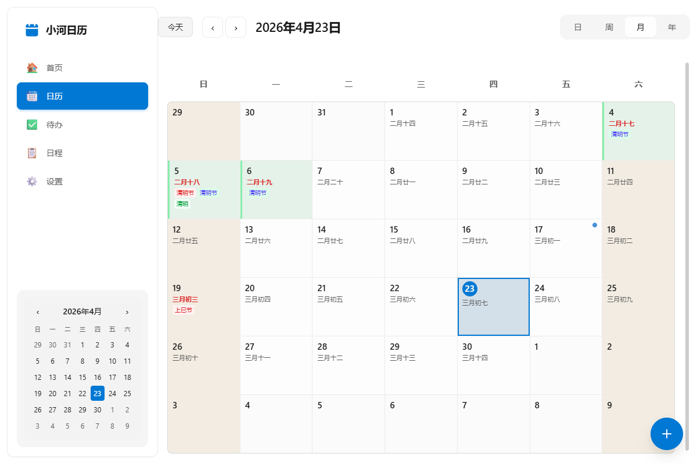
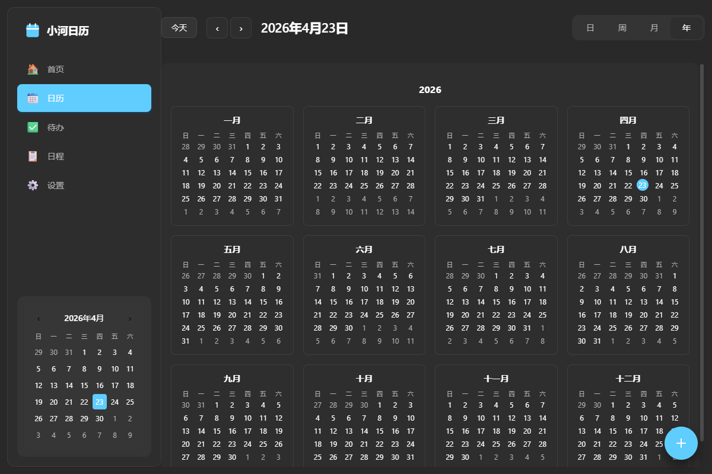
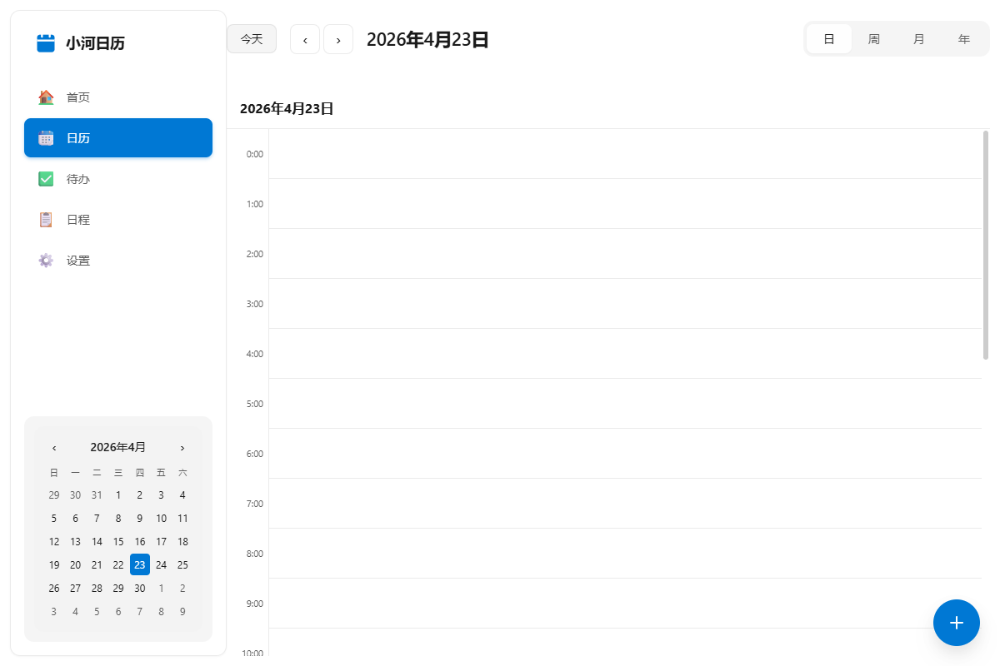
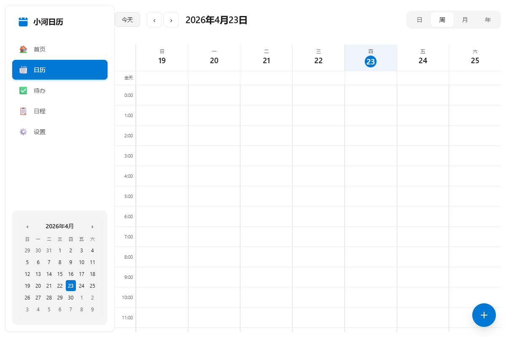
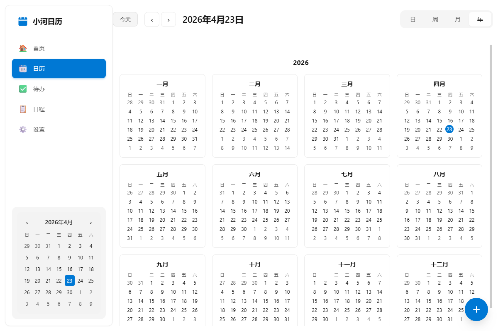
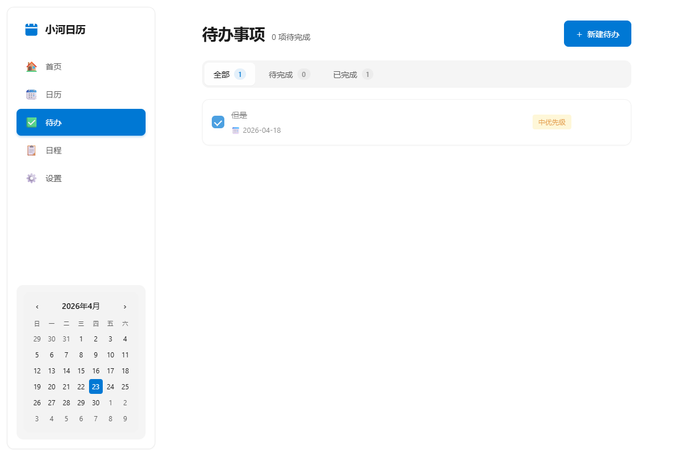
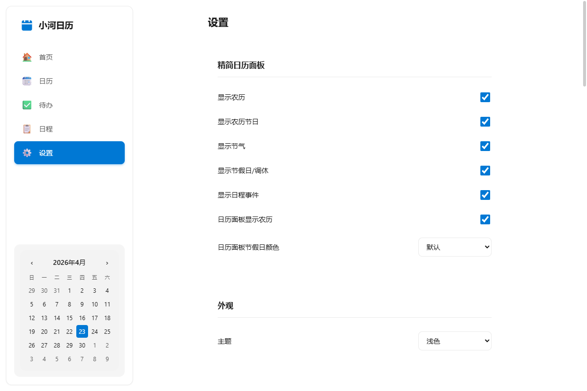

<div align="center">

# 小河日历 (SmartRiverCalendar)

**一款跨平台智能桌面日历应用**

[](https://tauri.app/)
[](https://vuejs.org/)
[](https://www.typescriptlang.org/)
[](LICENSE)

一款基于 Tauri 2.x + Vue 3 + TypeScript 构建的跨平台桌面日历应用，支持多日历管理、多种视图模式、农历/节假日显示。

</div>

## 功能特性

### 核心功能
- **多视图模式**: 支持日、周、月、年四种视图模式，自由切换
- **多日历管理**: 支持多个日历账户，独立颜色标识
- **农历支持**: 完整的农历日期显示，支持传统节日
- **节假日显示**: 中国法定节假日、调休补班标识
- **待办事项**: 集成待办管理，与日历事件无缝结合

### 技术特性
- **跨平台**: 支持 Windows 和 Android 平台
- **本地优先**: 离线可用，本地 SQLite 存储
- **系统集成**: 系统托盘运行、全局快捷键
- **主题支持**: 浅色/深色模式切换
- **自动更新**: 内置应用更新机制

## 截图预览

### 首页


### 日历视图

#### 月视图



#### 日视图


#### 周视图


#### 年视图


### 待办事项



### 设置页面



## 快速开始

### 环境要求

- Node.js 18+
- pnpm 8+
- Rust (通过 [rustup](https://rustup.rs/) 安装)
- Tauri CLI 依赖项 ([参考官方文档](https://tauri.app/v1/guides/getting-started/prerequisites))

### 安装

```bash
# 克隆项目
git clone https://github.com/xiaohai2271/SmartRiverCalender.git
cd SmartRiverCalender

# 安装依赖
pnpm install

# 启动开发服务器 (仅前端)
pnpm dev

# 启动 Tauri 桌面应用开发模式
pnpm tauri:dev
```

### 构建

```bash
# 构建前端
pnpm build

# 构建桌面应用
pnpm tauri:build
```

## 使用指南

### 基本操作
- **切换视图**: 点击顶部工具栏的日/周/月/年按钮
- **导航日期**: 使用左右箭头或点击"今天"按钮
- **创建事件**: 双击日期格子或使用快捷键 `Ctrl+N`
- **编辑事件**: 点击事件卡片进行编辑
- **删除事件**: 右键点击事件选择删除

### 快捷键
| 快捷键 | 功能 |
|--------|------|
| `Ctrl+N` | 新建事件 |
| `Ctrl+F` | 搜索 |
| `←` / `→` | 上一个/下一个时间段 |
| `Home` | 回到今天 |

### 设置选项
- **主题切换**: 浅色/深色模式
- **默认视图**: 设置启动时的默认视图
- **一周起始日**: 设置周一或周日为一周起始
- **显示选项**: 农历、节假日、节气等显示控制

## 开发指南

### 项目结构

```
SmartRiverCalender/
├── src/                      # Vue 3 前端源码
│   ├── components/           # UI 组件
│   │   ├── calendar/         # 日历视图组件
│   │   ├── settings/         # 设置组件
│   │   └── todo/             # 待办组件
│   ├── views/                # 页面视图
│   ├── stores/               # Pinia 状态管理
│   ├── types/                # TypeScript 类型定义
│   ├── utils/                # 工具函数
│   └── __tests__/            # 单元测试
├── src-tauri/                # Rust 后端 (Tauri)
└── dist/                     # 构建产物
```

### 常用命令

```bash
# 开发
pnpm dev                  # 启动 Vite 开发服务器
pnpm tauri:dev            # 启动 Tauri 应用

# 构建
pnpm build                # 构建前端
pnpm tauri:build          # 构建桌面应用

# 测试
pnpm test                 # 运行测试 (监听模式)
pnpm test:run             # 运行测试 (单次)
pnpm test:coverage        # 生成测试覆盖率报告

# 运行单个测试
pnpm vitest run src/__tests__/date.test.ts
```

详细开发指南请参考 [AGENTS.md](AGENTS.md)。

## 技术栈

| 类别 | 技术 |
|------|------|
| 桌面框架 | Tauri 2.x (Rust) |
| 前端框架 | Vue 3 + TypeScript |
| 构建工具 | Vite |
| 状态管理 | Pinia |
| UI 组件 | Fluent UI Web Components |
| 数据库 | SQLite (tauri-plugin-sql) |
| 测试框架 | Vitest |
| 包管理 | pnpm |

## 贡献指南

欢迎提交 Issue 和 Pull Request！

### 提交 Issue
- 请详细描述问题或建议
- 如果是 Bug，请提供复现步骤和环境信息

### 提交 PR
1. Fork 本项目
2. 创建特性分支 (`git checkout -b feature/AmazingFeature`)
3. 提交更改 (`git commit -m 'feat: Add some AmazingFeature'`)
4. 推送到分支 (`git push origin feature/AmazingFeature`)
5. 创建 Pull Request

## 许可证

本项目采用 MIT 许可证 - 详见 [LICENSE](LICENSE) 文件

## 致谢

- [Tauri](https://tauri.app/) - 优秀的跨平台桌面应用框架
- [Vue.js](https://vuejs.org/) - 渐进式 JavaScript 框架
- [Fluent UI](https://developer.microsoft.com/fluentui#/controls/web) - UI 组件库
- [tyme4ts](https://github.com/pfinal-nc/tyme4ts) - 农历/节假日处理库
- [Claude](https://claude.ai/) - AI 编程助手，提供代码生成和架构建议
- [OpCode](https://opencode.ai/) - AI 智能代理，协助开发和代码审查

## 联系方式

- 项目主页: [GitHub](https://github.com/xiaohai2271/SmartRiverCalender)
- Issue 反馈: [Issues](https://github.com/xiaohai2271/SmartRiverCalender/issues)

