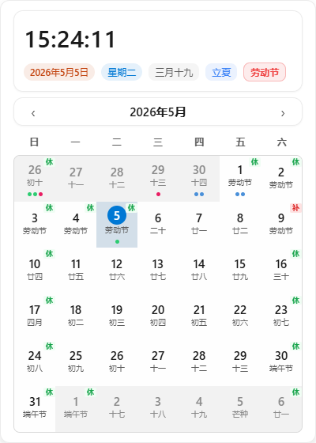

<div align="center">

# 小河日历 (SmartRiverCalendar)

**一款跨平台智能桌面日历应用**

[](https://tauri.app/)
[](https://vuejs.org/)
[](https://www.typescriptlang.org/)

一款基于 Tauri 2.x + Vue 3 + TypeScript 构建的跨平台桌面日历应用，支持多日历管理、多种视图模式、农历/节假日显示。

</div>

## 功能特性

### 核心功能
- **多视图模式**: 支持日、周、月、年四种视图模式，自由切换
- **多日历管理**: 支持多个日历账户，独立颜色标识
- **外部日历支持**: 支持 Exchange EWS 和 CalDAV 协议，可同步飞书、钉钉等外部日历
- **农历支持**: 完整的农历日期显示，支持传统节日、节气
- **节假日显示**: 中国法定节假日、调休补班标识，休/补徽标区分
- **待办事项**: 集成待办管理，与日历事件无缝结合
- **智能提醒系统**:
  - 独立提醒弹窗窗口，精简定位右下角
  - 支持稍后提醒、标记完成、查看详情
  - 与精简面板智能协调，避免遮挡
  - 支持系统原生通知和应用内弹窗双模式
- **日程管理**:
  - 时间交集匹配检索
  - 固定分组展示（今天、明天、未来一周、昨天）
  - 统一全天/普通事件样式
  - 日期格和事件块右键菜单快捷操作
- **精简面板**:
  - 紧凑/默认/宽松三种尺寸
  - 实时时钟、农历月份显示
  - 快速查看日期和日程
  - 与主窗口联动
- **时钟点击唤醒**: Windows 系统时钟点击检测，可唤醒已隐藏的应用窗口
- **系统托盘集成**: 最小化到系统托盘运行，支持托盘图标、右键菜单、快速操作

### 技术特性
- **跨平台**: 支持 Windows 和 Android 平台
- **本地优先**: 离线可用，本地 SQLite 存储，支持数据迁移
- **系统集成**:
  - 系统托盘运行、全局快捷键
  - Windows 时钟钩子检测
  - 开机自启、启动时最小化
  - 网络代理支持（系统代理/自定义代理）
- **主题支持**: 浅色/深色模式切换，Fluent Design 设计规范
- **自动更新**: 内置应用更新机制，支持自动检测和安装
- **MCP Bridge 支持**: 支持 MCP Bridge 插件，自动化测试和调试
- **数据层分离**: 严格的数据视图分离架构，提升代码可维护性

## 截图预览

### 首页


### 日历视图

#### 月视图


#### 日视图


#### 周视图


#### 年视图


### 待办事项


### 设置页面


### 精简日历面板



## 快速开始

### 环境要求

- Node.js 18+
- pnpm 8+
- Rust (通过 [rustup](https://rustup.rs/) 安装)
- Tauri CLI 依赖项 ([参考官方文档](https://tauri.app/start/prerequisites/))

### 安装

```bash
# 克隆项目
git clone https://github.com/xiaohai2271/SmartRiverCalender.git
cd SmartRiverCalender

# 安装依赖
pnpm install

# 启动开发服务器 (仅前端)
pnpm dev

# 启动 Tauri 桌面应用开发模式
pnpm tauri:dev
```

### 构建

```bash
# 构建前端
pnpm build

# 构建桌面应用
pnpm tauri:build
```

## 使用指南

### 基本操作
- **切换视图**: 点击顶部工具栏的日/周/月/年按钮
- **导航日期**: 使用左右箭头或点击"今天"按钮
- **创建事件**: 双击日期格子或使用快捷键 `Ctrl+N`
- **编辑事件**: 点击事件卡片进行编辑
- **删除事件**: 右键点击事件选择删除
- **快速操作**: 日期格和事件块右键菜单，支持快捷操作
- **精简面板**: 从托盘菜单或设置中启用，快速查看日程

### 快捷键
| 快捷键 | 功能 |
|--------|------|
| `Ctrl+N` | 新建事件 |
| `Ctrl+F` | 搜索 |
| `←` / `→` | 上一个/下一个时间段 |
| `Home` | 回到今天 |
| `Esc` | 关闭当前弹窗 |

### 设置选项
- **外观设置**:
  - 主题切换: 浅色/深色模式
  - 默认视图: 设置启动时的默认视图
  - 一周起始日: 设置周一或周日为一周起始
  - 显示选项: 农历、节假日、节气等显示控制
- **精简面板设置**:
  - 窗口大小: 紧凑/默认/宽松
  - 显示选项: 今日信息、徽标样式
- **系统集成**:
  - 开机自启
  - 启动时最小化
  - 点击系统时钟唤醒窗口
  - 阻止系统日历弹窗
- **网络设置**:
  - 代理模式: 不走代理/系统代理/自定义代理
  - 代理测试: 测试代理连接状态
- **更新设置**:
  - 自动更新检查

## 开发指南

### 项目结构

```
SmartRiverCalender/
├── src/                      # Vue 3 前端源码
│   ├── components/           # UI 组件
│   │   ├── calendar/         # 日历视图组件 (DayView, WeekView, MonthView, YearView)
│   │   │   ├── DateCellContextMenu.vue  # 日期格右键菜单
│   │   │   └── EventBlockContextMenu.vue # 事件块右键菜单
│   │   ├── settings/         # 设置组件
│   │   │   └── SystemTab.vue            # 系统设置标签
│   │   ├── todo/             # 待办组件
│   │   ├── popup/            # 弹窗组件
│   │   │   ├── PopupCalendarGrid.vue    # 弹窗日历网格
│   │   │   └── PopupDateInfo.vue        # 弹窗日期信息
│   │   ├── reminder/         # 提醒组件
│   │   │   └── ReminderPopup.vue        # 提醒弹窗组件
│   │   └── home/             # 首页组件
│   ├── views/                # 页面视图
│   │   ├── CalendarView.vue           # 日历视图
│   │   ├── CalendarPopupView.vue      # 精简面板视图
│   │   ├── ReminderPopupView.vue      # 提醒弹窗视图
│   │   ├── ScheduleView.vue           # 日程视图
│   │   ├── TodosView.vue              # 待办视图
│   │   └── SettingsView.vue           # 设置视图
│   ├── stores/               # Pinia 状态管理
│   │   ├── settings.ts               # 应用设置
│   │   └── popupSettings.ts           # 精简面板设置
│   ├── services/             # 业务逻辑服务 (提醒、同步、更新)
│   │   ├── reminder.ts               # 提醒服务
│   │   ├── sync.ts                   # 日历同步
│   │   └── settings.ts               # 设置服务
│   ├── composables/          # 组合式函数
│   │   ├── useReminderPopup.ts       # 提醒弹窗控制
│   │   └── useCalendarPopup.ts       # 精简面板控制
│   ├── router/               # 路由配置
│   ├── types/                # TypeScript 类型定义
│   ├── utils/                # 工具函数
│   ├── styles/               # 样式文件
│   └── __tests__/            # 单元测试
├── src-tauri/                # Rust 后端 (Tauri)
│   ├── src/
│   │   ├── commands.rs       # Tauri 命令
│   │   ├── caldav.rs         # CalDAV 协议支持
│   │   ├── exchange.rs       # Exchange EWS 协议支持
│   │   ├── clock_hook/       # Windows 时钟钩子
│   │   └── updater.rs        # 自动更新
│   └── tauri.conf.json       # Tauri 配置
├── dist/                     # 构建产物
└── screenshots/              # 应用截图
```

### 常用命令

```bash
# 开发
pnpm dev                  # 启动 Vite 开发服务器
pnpm tauri:dev            # 启动 Tauri 应用

# 构建
pnpm build                # 构建前端
pnpm tauri:build          # 构建桌面应用

# 测试
pnpm test                 # 运行测试 (监听模式)
pnpm test:run             # 运行测试 (单次)
pnpm test:coverage        # 生成测试覆盖率报告

# 运行单个测试
pnpm vitest run src/__tests__/date.test.ts
```

详细开发指南请参考 [AGENTS.md](AGENTS.md)。

## 版本历史

详细更新记录请查看 [CHANGELOG.md](CHANGELOG.md)

### v0.1.2 (2026-04-30)
- 🚀 日程界面优化：统一样式、时间交集匹配、固定分组展示
- 🎨 优化提醒弹窗定位和精简面板协调

### v0.1.1 (2026-04-25)
- 🚀 应用核心框架初始化
- 🚀 多视图模式、多日历管理、外部日历集成
- 🚀 智能提醒系统、系统托盘集成、自动更新
- 🚀 时钟点击唤醒、精简日历弹窗
- 🎨 Fluent Design 主题、OpenSpec 框架、MCP Bridge 支持

## 技术栈

| 类别 | 技术 |
|------|------|
| 桌面框架 | Tauri 2.x (Rust) |
| 前端框架 | Vue 3 + TypeScript |
| 构建工具 | Vite |
| 状态管理 | Pinia |
| UI 组件 | Fluent UI Web Components |
| 数据库 | SQLite (tauri-plugin-sql) |
| 测试框架 | Vitest |
| 包管理 | pnpm |

## 贡献指南

欢迎提交 Issue 和 Pull Request！

### 提交 Issue
- 请详细描述问题或建议
- 如果是 Bug，请提供复现步骤和环境信息

### 提交 PR
1. Fork 本项目
2. 创建特性分支 (`git checkout -b feature/AmazingFeature`)
3. 提交更改 (`git commit -m 'feat: Add some AmazingFeature'`)
4. 推送到分支 (`git push origin feature/AmazingFeature`)
5. 创建 Pull Request

## 致谢

- [Tauri](https://tauri.app/) - 优秀的跨平台桌面应用框架
- [Vue.js](https://vuejs.org/) - 渐进式 JavaScript 框架
- [Fluent UI](https://developer.microsoft.com/fluentui#/controls/web) - UI 组件库
- [tyme4ts](https://github.com/pfinal-nc/tyme4ts) - 农历/节假日处理库
- [Claude](https://claude.ai/) - AI 编程助手，提供代码生成和架构建议
- [OpCode](https://opencode.ai/) - AI 智能代理，协助开发和代码审查

## 联系方式

- 项目主页: [GitHub](https://github.com/xiaohai2271/SmartRiverCalender)
- Issue 反馈: [Issues](https://github.com/xiaohai2271/SmartRiverCalender/issues)

